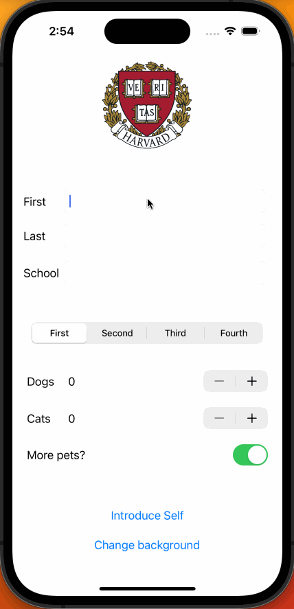

## IntroduceStudent

### App Description

IntroduceStudent is a functional app that takes advantage of the the basics of storyboarding and Swift. This app allows the user to introduce themselves by accepting user inputs in various forms, such as switches, text fields, segmented controls, and more.

### App Walk-though

 

### Required Features

- [x] 1. App displays an image of a school's logo
- [x] 2. App has three textfields for first, last, and school names
- [x] 3. App has a segmented control that changes student year
- [x] 4. Number of pet matches label is increased/decreased by stepper
- [x] 5. Switch makes a statement about wanting more pets or not(true/false) 
- [x] 6. Introduce yourself button shows alert box with an introduciton and dismiss button

### Optional Features

- [x] 1. User can tap a button to change the color of the background view
- [x] 3. User can select on additional buttons that provide more info about the user. Example: more textfields, a different alert box, etc.
- [x] 4. Any stylistic changes that are not default options (Dogs/dog, cats/cat in alert message based on label values)
